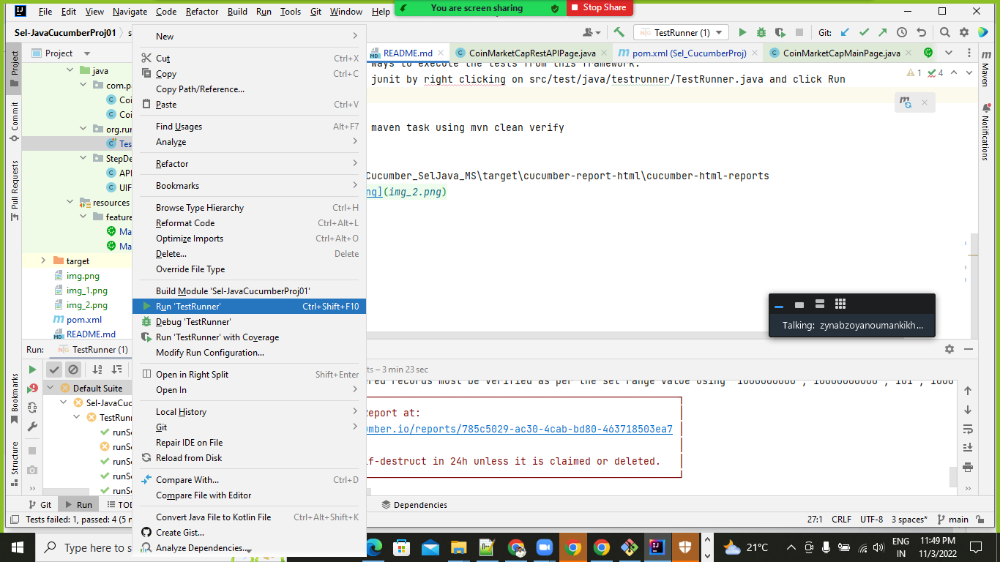
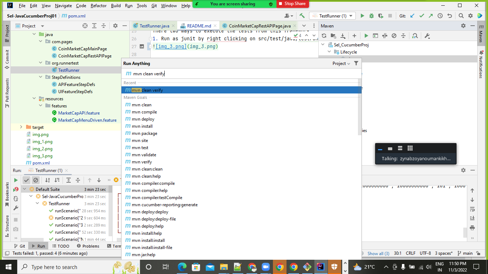
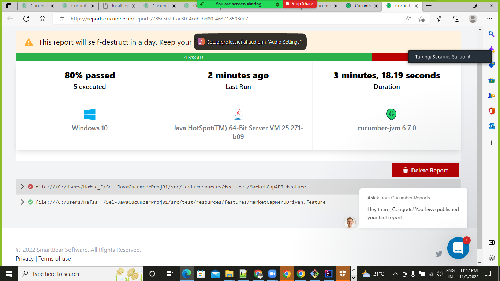

# Sel-JavaCucumberProj01
This is an End to End framework that covers WEB and API Automation using Java / Selenium /Rest Assured and Cucumber BDD.

System Requirements - prerequisites
--Java 8
--Maven

Sample Feature File Cucumber :

Feature: CoinMarketCap UI Tasks

Background: user navigates to given application
Given user navigates to CoinMarketCap URL

Scenario: 1 - Open CoinMarketCap application and verify number of rows displayed
When user selects Show rows dropdown and selects Value
Then selected number of rows must be displayed

Note: First time when cloned wait for dependecies to downlaod and project to sync.

Steps to execute the tests:

There two ways to execute the tests from this framework:
1. Run as junit by right clicking on src/test/java/testrunner/TestRunner.java and click Run

2. Run as maven task using mvn clean verify

Report - Cucumber_SelJava_MS\target\cucumber-report-html\cucumber-html-reports

